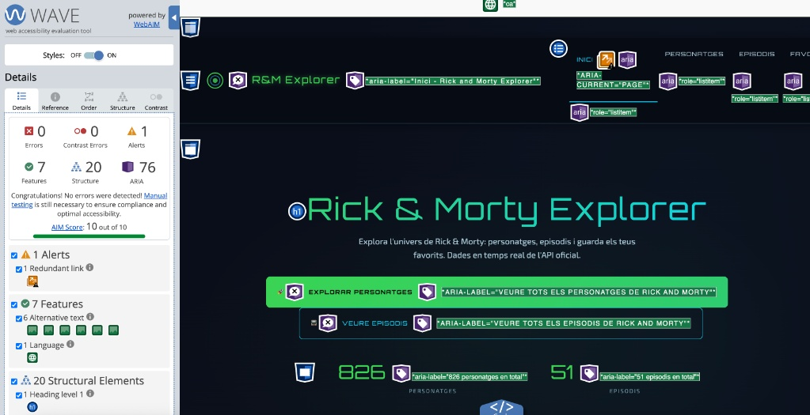
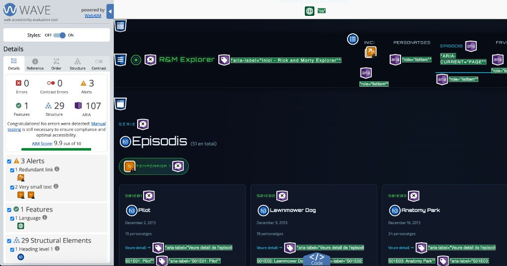
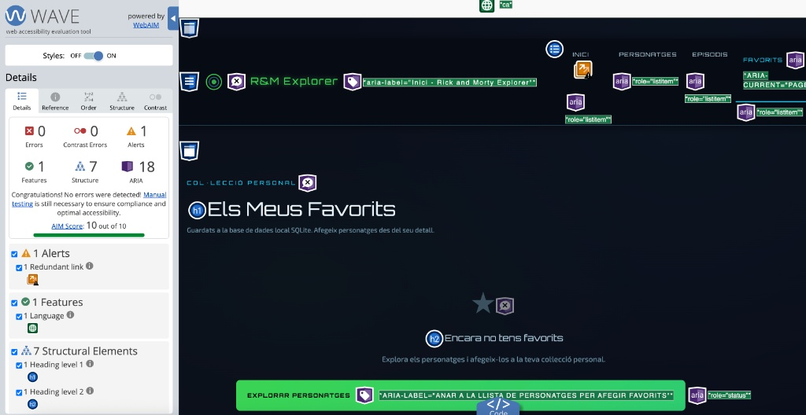

Módulo MP09 - AV3
=================

Explorador web del universo de Rick and Morty
---------------------------------------------

### Justificación y motivación

Este proyecto académico tiene como objetivo integrar el consumo de una API REST externa con la persistencia de datos en una base de datos local, aplicando el patrón MVC (Model-View-Controller) en .NET Core MVC. El enfoque permite combinar datos en tiempo real del universo de Rick and Morty con información propia de la aplicación, garantizando separación de responsabilidades, mantenibilidad y escalabilidad.

### Esquema de arquitectura

```text
+-----------+
| Usuario   |
+-----+-----+
      |
      v
+-----------------------------+
| Controlador MVC            |
| (gestión de peticiones)    |
+-----------+----------------+
            |
            v
+------------------------+       +---------------------------+
| API externa Rick&Morty |       | BBDD local SQLite        |
| (personajes/episodios) |       | (favoritos)              |
+-----------+------------+       +-------------+------------+
            |                              |
            +---------------+--------------+
                            v
+---------------------------+
| Vistas Razor/HTML/CSS     |
| (respuesta al usuario)    |
+---------------------------+
```

### Explicación detallada del código

La aplicación separa claramente la lógica de negocio según la fuente de datos:

- Personajes y episodios: se cargan desde la API oficial de Rick and Morty en tiempo real mediante peticiones HTTP desde la capa de servicios.
- Favoritos: se gestionan contra la base de datos local SQLite para mantener un estado propio de la aplicación.

Para la serialización y deserialización de datos JSON se ha utilizado de forma explícita la librería **Newtonsoft.Json**, fundamental para mapear de forma fiable las respuestas de la API a los modelos del dominio.

### Cumplimiento de requisitos MP09 (AV3)

Este proyecto cumple el requisito de **“codificar múltiples rutas al controlador, modelos y vistas que muestren datos de consumo de un servicio Web y consultas a BBDD”** del módulo MP09.

- **Controladores y rutas**
  - `HomeController`: acciones `Index` y `Error`.
  - `RickAndMortyController`: acciones `Characters`, `Character`, `Episodes`, `Episode`, `Favorites`, `AddFavorite` y `RemoveFavorite`.
  - En total, varias rutas funcionales que responden a URLs distintas y muestran información diferente.

- **Modelos y ViewModels**
  - Modelos de dominio: `Character`, `Episode`, `FavoriteCharacter`, `ApiResponse<T>` y `Location`.
  - ViewModels: `HomeViewModel`, `CharacterListViewModel`, `CharacterDetailViewModel`.
  - Se utilizan para separar claramente la información procedente de la API, de la base de datos y de la presentación en las vistas.

- **Vistas Razor**
  - Vistas fuertemente tipadas para: Home, listado de personajes, detalle de personaje, listado de episodios, detalle de episodio y favoritos.
  - Cada acción de controlador tiene asociada una vista que muestra los datos correspondientes.

- **Consumo de servicio Web**
  - Servicio `RickAndMortyService` que llama a la API oficial (`https://rickandmortyapi.com/api`) mediante HttpClient.
  - Se consumen recursos de personajes y episodios, con paginación y filtros opcionales.

- **Consultas a base de datos**
  - `AppDbContext` con DbSet de `FavoriteCharacter` y configuración SQLite.
  - Las acciones `Favorites`, `AddFavorite` y `RemoveFavorite` trabajan directamente contra la base de datos para leer, añadir y eliminar favoritos.

Estos puntos dejan explícito que el proyecto utiliza **MVC**, múltiples rutas, modelos y vistas, consumo de un servicio web y consultas a una base de datos SQLite, tal y como exige el enunciado.

### Acceso a producción

- URL de producción: http://hakkai01-001-site1.ntempurl.com/

### Accesibilidad y UX

Se han realizado validaciones de accesibilidad con la extensión WAVE sobre tres secciones en producción:

- Home: puntuación 10/10, 0 errores y 0 errores de contraste.
- Episodios: puntuación 9.9/10, 0 errores y 0 errores de contraste.
- Favoritos: puntuación 10/10, 0 errores y 0 errores de contraste.

Estos resultados evidencian un nivel alto de cumplimiento WCAG, sin incidencias críticas de accesibilidad. Las alertas detectadas por WAVE son de carácter preventivo y no implican errores de conformidad. Asimismo, se han implementado etiquetas `aria-label` dinámicas generadas con Razor para mejorar la navegación asistida tanto en vistas alimentadas por la API como en vistas con datos persistidos en SQLite.

#### Evidencias visuales (WAVE)

Capturas adjuntas de validación WAVE en producción:





### Propuestas de mejora

- Implementar roles de usuario para controlar los permisos de forma más granular (administrador, usuario estándar, etc.).
- Incorporar filtros avanzados que combinen datos de la API externa y de la base de datos local para enriquecer la búsqueda y la exploración.
- Añadir más pruebas de accesibilidad automáticas y manuales para mantener el nivel de calidad a largo plazo.

### Tecnologías utilizadas

- C#
- .NET Core MVC
- Razor
- HTML
- CSS
- JavaScript
- Newtonsoft.Json
- SQLite


### Análisis técnico de accesibilidad (WAVE) en entorno de producción

Se ha realizado una evaluación de accesibilidad con la herramienta WAVE en tres vistas funcionalmente representativas del sistema: Home, Episodios y Favoritos. El objetivo del análisis ha sido verificar el grado de cumplimiento de buenas prácticas WCAG en páginas que consumen datos desde fuentes distintas (API REST externa y base de datos local SQLite).

### Resultados observados

- Home: 10/10, con 0 errores y 0 errores de contraste.
- Episodios: 9.9/10, con 0 errores y 0 errores de contraste.
- Favoritos: 10/10, con 0 errores y 0 errores de contraste.

En las tres capturas no se detectan errores críticos ni incidencias de contraste, lo cual confirma una base de accesibilidad sólida en componentes estructurales, semánticos y visuales. Las alertas mostradas por WAVE se clasifican como advertencias preventivas y no constituyen fallos de conformidad WCAG.

### Interpretación académica de cumplimiento WCAG

Las puntuaciones obtenidas permiten afirmar que el proyecto presenta un alto nivel de alineación con criterios WCAG, especialmente en los ejes de perceptibilidad y robustez. La ausencia de errores de contraste respalda la legibilidad del contenido para usuarios con diversidad visual, mientras que la ausencia de errores críticos sugiere una correcta implementación de estructura semántica y navegación asistida.

### Evidencia de implementación accesible en API y BBDD

Un aspecto relevante del proyecto es la coherencia accesible en ambos modelos de datos:

- Vistas con datos de API (por ejemplo, Episodios): se observa etiquetado accesible en elementos dinámicos renderizados desde respuestas externas.
- Vistas con datos de base de datos local (por ejemplo, Favoritos): se mantiene el mismo criterio de accesibilidad en contenido persistido localmente.

En ambos casos, se emplean etiquetas `aria-label` generadas dinámicamente con Razor, lo que permite que la semántica accesible se adapte al contenido real mostrado en tiempo de ejecución.

### Conclusión

La validación técnica mediante WAVE evidencia que la aplicación alcanza un nivel excelente de accesibilidad para un proyecto académico MVC, con rendimiento estable en páginas de distinta naturaleza funcional y origen de datos. Como línea de mejora futura, se recomienda mantener auditorías periódicas y revisar alertas preventivas para consolidar aún más la calidad de la interfaz.
